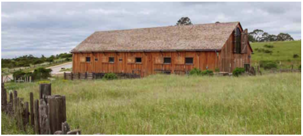
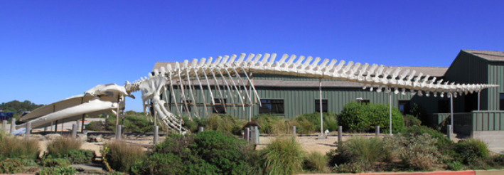
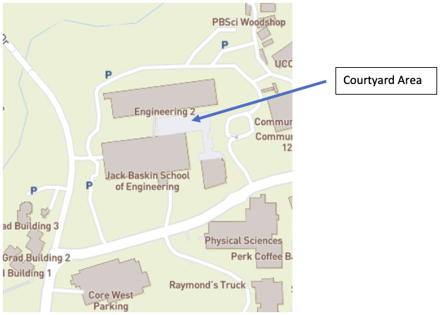
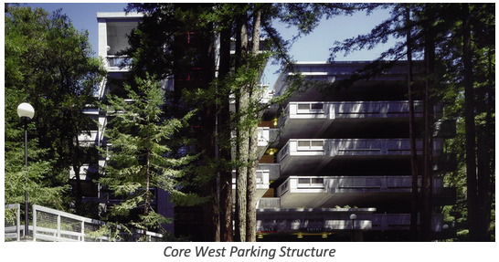
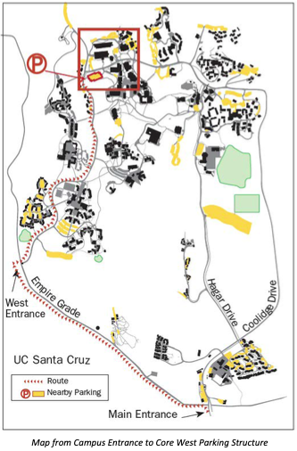
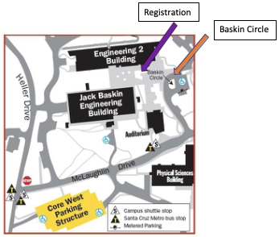

  
<a class="twitter-timeline" data-lang="en" data-width="200" data-height="600" href="https://twitter.com/ssdbm2019?ref_src=twsrc%5Etfw">News by ssdbm2019</a> 

# Welcome to SSDBM 2019 #

**The 31st International Conference on Scientific and Statistical Database Management will be held in Santa Cruz, CA, USA on July 23-25, 2019.** The SSDBM international conference brings together scientific domain experts, database researchers, practitioners, and developers for the presentation and exchange of current research results on concepts, tools, and techniques for scientific and statistical database applications. The 31st SSDBM will provide a forum for original research contributions and practical system design, implementation and evaluation, and, for the first time, reproducibility studies of previous publications. The program of the research track will be supplemented with invited talks and demonstrations. SSDBM 2019 will continue the tradition of past SSDBM meetings in providing a stimulating environment to encourage discussion, fellowship and exchange of ideas in all aspects of research related to scientific and statistical data management.

Tanu Malik (Program Chair)  
Ivo Jimenez (Reproducibility Chair)  
Carlos Maltzahn (General Chair)  

### We thank our sponsors

### Local organizers
 

# Conference Organizers #

### Chairs

**General:** [Carlos Maltzahn](https://users.soe.ucsc.edu/~carlosm), University of California, Santa Cruz - **Program:** [Tanu Malik](http://facsrv.cs.depaul.edu/~tmalik1), DePaul University, Chicago - **Reproducibility:** [Ivo Jimenez](https://users.soe.ucsc.edu/~ivo/), University of California, Santa Cruz - **Demos:** TBD - **Local Arrangements:** Lavinia Preston and Stephanie Lieggi, University of California, Santa Cruz - **Proceedings:** Tanu Malik - **Web:** Ivo Jimenez 

To contact any of the chairs, please use [ssdbm19@easychair.org](mailto:ssdbm19@easychair.org).

### Steering Committee
[Arie Shoshani](https://sdm.lbl.gov/~arie/), Lawrence Berkeley National Laboratory (chair)  
[Torben Bach Pedersen](http://people.cs.aau.dk/~tbp/), Aalborg University  
[Magdalena Balazinska](https://www.cs.washington.edu/people/faculty/magda), University of Washington  
[Amarnath Gupta](http://www.sdsc.edu/~gupta/), University of California San Diego  
[Ioana Manolescu](http://pages.saclay.inria.fr/ioana.manolescu/), Inria-Paris  

### Program Committee
Gagan Agrawal, Ohio State University  
Peter Baumann, Jacobs University, Bremen  
Khalid Bellhajahme, University Paris-Dauphine  
Souvik Bhattacharjee, University of Maryland, College Park  
Tamas Budavari, Johns Hopkins University  
Lazlo Doblos, Eötvös Loránd University, Budapest  
Shawfeng Dong, SLAC National Accelerator Laboratory  
Ahmed Eldawy, University of California, Riverside  
Thomas Heinis, Imperial College, UK  
Ashish Gehani, SRI International  
Boris Glavic, Illinois Institute of Technology, Chicago  
Pascal Grosset, Los Alamos National Laboratory  
Ian Foster, University of Chicago, Chicago  
Verena Kantere, University of Ottawa, Ontario  
Jeff LeFevre, University of California, Santa Cruz  
Ulf Leser, Humboldt-Universität zu Berlin  
Qing Gary Liu, New Jersey Institute of Technology  
Marjan Mernik, University of Maribor  
Paolo Missier, Newcastle University  
Beth Plale, Indiana University, Bloomington  
Neolkis Polyzotis, Google, Inc.  
Dave Pugmire, Oakridge National Laboratory  
Maya Ramanath, Indian Institute of Technology, Delhi  
Alexander Rasin, DePaul University, Chicago  
Tore Risch, Uppsala University  
Florin Rusu, University of California, Merced  
Iulian Sandu-Popa, University of Versailles Saint-Quentin and INRIA  
Galen Shipman, Los Alamos National Laboratory  
Douglas Thain, University of Notre Dame  
Srikanta Tirthapura, Iowa State University  
Yicheng T,u University of South Florida, Tampa  
Jon Woodring,  Los Alamos National Laboratory  
K. John Wu, Lawrence Berkeley National Laboratory  
Hongfeng Yu, University of Nebraska, Lincoln  
Xuechen Zhang, Washington State University  
Ming Zhao, Arizona State University, Phoenix  
Qiang Zhi, University of Michigan, Dearborn  

# Call for Contributions

The SSDBM international conference brings together scientific domain experts, database researchers, practitioners, and developers for the presentation and exchange of current research results on concepts, tools, and techniques for scientific and statistical databases and applications. The 31st SSDBM provides a forum for original research contributions and practical system designs, implementations and evaluations. The program of the research track will be supplemented with invited talks and demonstrations.

SSDBM 2019 will continue the tradition of past SSDBM meetings in providing a stimulating environment to encourage discussion and exchange of ideas on all aspects of research related to scientific and statistical data management.

All accepted papers will be published by ACM – International Conference Proceedings Series (ICPS) and will be available in the ACM Digital Library. 

### Topics of Interest
SSDBM 2019 will have a focus on high-performance data analysis tools and techniques for large data sets, with a special emphasis on genomics, astrophysics, and high-energy physics. The conference encourages authors to make their experimental results reproducible and include reproducibility experiences in their submissions .

Topics of particular interest include, but are not limited to, the following, as they relate to scientific and statistical data management:

- System architectures for scientific and statistical data management and analysis
- Querying of scientific data, including spatial, temporal, and streaming data
- Mining and analysis of large-scale datasets, especially on new and emerging hardware and environments
- Data flow management in high performance computing
- Techniques for comparing simulation and experimental data
- Cloud computing issues in large-scale data management
- Provenance data management
- Design, implementation, optimization, and reproducibility of scientific workflows
- Integration and exchange of data, including the federation and management of institutional data repositories
- Visualization and exploration of large datasets
- Information retrieval and text mining
- Knowledge discovery, clustering, graph analysis
- Case studies, particularly those at scale-of-consequence for genomics, astrophysics, and high-energy physics
- Stream data management, e.g., storage, organization, compression, indexing and querying
- Stream data analysis, e.g., summarization, statistical analysis, pattern matching, pattern discovery, learning, and prediction
- Modeling and representation of streaming data

### Submission guidelines
We solicit papers describing original work relevant to the management of scientific and statistical data and not published or under review elsewhere. SSDBM 2019 is single-blind reviewed. Therefore, authors must include their names and affiliations on the first page.  SSDBM submissions can be research, reproducibility study, or demo papers (all page limits including everything):
 
**Research Papers (LONG and SHORT):** We solicit both full papers (12 pages) and short papers (4 pages). The former tend to be descriptions of complete technical work, while the latter tend to be descriptions of interesting, innovative ideas, which nevertheless require more work to mature. The program committee may decide to accept some full papers as short papers. Full papers will be given a presentation slot in the conference, while short papers will be presented in the form of posters. All papers, regardless of size, will be given an entry in the conference proceedings. Authors may optionally include reproducibility information that allows for automated validation of experimental results (see [artifact evaluation criteria](https://docs.google.com/document/d/1gvRFgXjkLdRMcpGbYHK136pXZdmVC0u6f-T9n6PKHVA/edit?usp=sharing)). Accepted submissions passing automated validation will earn a prestigious “Results Replicated” Badge in the ACM DL in accordance with [ACM’s artifact review and badging policy](https://www.acm.org/publications/policies/artifact-review-badging).

**New! Reproducibility Study Papers:** We also call for reproducibility studies (12 pages) that for the first time reproduce experiments from papers previously published in SSDBM or in other peer-reviewed conferences with similar topics of interest (see [reproducibility study instructions](https://docs.google.com/document/d/1TdD3W9aU2Crnm5g5cI-nBomY4v0m2jMYRHUVd8qgE-U/edit?usp=sharing)). Reproducibility study submissions are selected by the same peer-reviewed competitive process as regular research papers, except these submissions must pass automated validation of experimental results (see [artifact evaluation criteria](https://docs.google.com/document/d/1gvRFgXjkLdRMcpGbYHK136pXZdmVC0u6f-T9n6PKHVA/edit?usp=sharing)). Accepted submissions passing automated validation will earn the prestigious ACM “Results Replicated” Badge and, if the work under study was successfully reproduced, the associated paper will earn the ACM “Results Reproduced” Badge in the ACM DL in accordance with [ACM’s artifact review and badging policy](https://www.acm.org/publications/policies/artifact-review-badging).
 
**Demo Papers:** We solicit demonstration proposals (4 pages) which should provide the motivation for the demonstrated concepts, the information about the technology and the system to be demonstrated (including a system description, functionality and figures when applicable), and should state the significance of the contribution. Selection criteria for the demonstration proposals evaluation include: the novelty, the technical advances and challenges, and the overall practical attractiveness of the demonstrated system. Demo papers will also be given an entry in the conference proceedings.

The submission website is [https://easychair.org/conferences/?conf=ssdbm19](https://easychair.org/conferences/?conf=ssdbm19).  Submissions are accepted in PDF format using the new ACM proceedings LATEX or Word templates. Authors should use the sigconf proceedings template. Please see instructions at the ACM web site: [http://www.acm.org/publications/article-templates/proceedings-template.html](http://www.acm.org/publications/article-templates/proceedings-template.html). If you are encountering any problems using the LATEX templates, please contact [acmtexsupport@aptaracorp.com](mailto:acmtexsupport@aptaracorp.com). For all other questions, please contact [ssdbm19@easychair.org](mailto:ssdbm19@easychair.org).
 
### Important dates
The following deadlines apply to long, short, reproducibility study, and demo papers:
 
Paper submission: **March 4, 2019**  
Notification of acceptance: April 26, 2019  
Camera ready copy: June 3, 2019  

### Camera-ready Instructions

All accepted papers will be published by ACM – International Conference Proceedings Series (ICPS) and will be available in the ACM Digital Library.

**IMPORTANT:** ACM now requires conference organizers to collect and submit the **source files for each paper – all files which were used to create the final output (PDF), be they Word, LaTeX, image files, etc.** Submission of source files was always a requirement, albeit one that was hardly enforced in the past. In anticipation of serving both accessibility compliant PDF and responsive HTML5 formatted files from the ACM Digital Library, ACM is now enforcing this requirement.

The deadline for submitting the camera-ready paper is June 3rd. This is a hard deadline; late submissions will not be included in the proceedings. To prepare the camera-ready version, please follow these steps:

ACM now requires conference organizers to collect and submit the **source files for each paper – all files which were used to create the final output (PDF), be they Word, LaTeX, image files, etc.** Submission of source files was always a requirement, albeit one that was hardly enforced in the past. In anticipation of serving both accessibility compliant PDF and responsive HTML5 formatted files from the ACM Digital Library, ACM is now enforcing this requirement.
1. Authors who are specified in EasyChair as contacts must have received an email from ACM Rightsreview (rightsreview@acm.org) with a link to the electronic ACM copyright-permission form. Please complete the form as soon as possible. **IMPORTANT: the email is sent by an automated system to the primary contact only. Please make sure that the authors specified as contacts have received the email and that it has not wound up in a Spam folder.**
1. Upon completion of the ACM rights management form, the authors will receive an email with instructions on how to include rights and permissions information, and the bibliographic strip into the camera-ready version. Your **must** enter the text into their paper. Please follow the instructions carefully.
1. Ensure that your camera-ready version complies with the ACM Master Template. Instructions are available at [https://www.acm.org/publications/proceedings-template](https://www.acm.org/publications/proceedings-template). You should use the "sigconf" proceedings template. If you have any problems with the templates, please contact ACM’s TeX support team at Aptara ([acmtexsupport@aptaracorp.com](acmtexsupport@aptaracorp.com)).
1. Use the online CCS indexing tool ([http://dl.acm.org/ccs/ccs.cfm?](http://dl.acm.org/ccs/ccs.cfm?)) to select appropriate CCS concepts for your article. Then, generate the corresponding text/code and include it into your camera-ready version.
1. Create the camera-ready PDF, paying attention to the following:
   1. Adhere to the page limits: 12 pages for full and reproducibility study papers, 4 pages for short and demo papers.
   1. Page size should be US-Letter 8.5in x 11in (around 21.59cm x 27.94cm).
   1. All fonts must be Type 1 (scalable), and not Type 3 (bit-mapped). All fonts must be embedded within the PDF file. See instructions here: [http://www.ec.tuwien.ac.at/~dimitris/var/fonts.html](http://www.ec.tuwien.ac.at/~dimitris/var/fonts.html).
   1. Do not include page numbers.
1. Submit the camera-ready PDF in EasyChair ([https://easychair.org/conferences/?conf=ssdbm19](https://easychair.org/conferences/?conf=ssdbm19)). In addition to the camera-ready PDF, you **must** also submit an archive (zip or tgz) with the source files (LaTeX or Word).

For any questions regarding your camera-ready version, please contact [ssdbm19@easychair.org](mailto:ssdbm19@easychair.org). 

# Program
### Proceedings
### Accepted Papers
### Keynotes
### Program Overview
### Detailed Program
### Social Events

#### July 23, 5:00-7:00pm – Reception at the historic Cowell Hay Barn on the UCSC Campus ####

The original Cowell Ranch Hay Barn was built in the early 1860s as part of the Cowell Lime Works operation. The Hay Barn was an integral part of the Cowell Ranch, housing feed and the animals that hauled logs, limestone, and finished lime. Today the Hay Barn and the many nearby historic structures from the lime works period are part of the Cowell Lime Works Historic District.

The original Hay Barn was completely disassembled and renovated in 2015 to serve as a space for public use and headquarters of the Center for Agroecology & Sustainable Food Systems.

The reconstructed Hay Barn incorporates some of the historic barn's heavy timbers and siding, and features traditional mortise-and-tenon framing juxtaposed with modern materials and contemporary design, to achieve a rustic yet visually distinct building. The award-winning result is a beautiful and dramatic signature building with a soaring, spacious interior offering a unique setting for weddings, banquets, concerts, conferences, and much more. See [https://cowellhaybarn.ucsc.edu/](https://cowellhaybarn.ucsc.edu/) for more information about the Hay Barn and its history.

#### July 24, 5:30-8:30pm – Reception & Banquet at the Seymour Marine Discovery Center ####

The Seymour Marine Discovery Center is a community-supported marine science education center of the University of California, Santa Cruz. It resides on the UC Santa Cruz Coastal Science Campus, a dynamic hub for research, education, and policy programs that address coastal and ocean conservation and management issues. Here, some of the world’s best coastal and marine scientists, government and non-government experts, and public education leaders create synergies that result in discovery and effective conservation solutions. The Center in the public face of this work.

Through our breathtaking seaside learning center, we bring the adventures and explorations of ocean science to life. Powered by the Long Marine Laboratory, a world-renowned university research facility, the Seymour Marine Discovery Center offers hands-on immersion into the world of ocean exploration and discovery. With a 20,000-square-foot visitor center, guests can touch a shark, explore the latest discoveries in ocean science, and take in the spectacular Monterey Bay, called the “Serengeti of the Sea,” for its incredible diversity of marine life.

The Center offers a deeper dive into the research conducted at Long Marine Lab and a chance for everyone to find their inner scientist through rich experiential learning programs including school field-trips, summer youth programs, Science Sundays, volunteer opportunities, internships, and more.
SSDBM attendees will enjoy appetizers and drinks from 5:30 to 6:30 on the Shipwreck Deck overlooking the ocean. The exhibits will be open just for us and docents will be available at the seawater table. A buffet dinner will follow from 6:30-8:30 in the La Feliz Room.

For more information on the Seymour Center, please go to [https://seymourcenter.ucsc.edu](https://seymourcenter.ucsc.edu)

# Information for Participants
### Registration
### Accommodation
### Conference Venue

#### About UC Santa Cruz ####

Since its founding in 1965, the University of California, Santa Cruz, has earned international distinction as a university with high-impact research and an uncommon commitment to teaching and public service.

A campus with world-class facilities and one of the most visually spectacular settings in higher education, UC Santa Cruz offers rigorous academic programs and cutting-edge research opportunities that teach students how to think, not what to think. Commitments to environmental stewardship and community engagement are central to UCSC's core values.

From 652 students in 1965, the campus has grown to its current (2017-18) enrollment of more than 18,000 students. Undergraduates pursue bachelor's degrees in 65 different majors supervised by divisional deans of [arts](https://arts.ucsc.edu/), [engineering](https://soe.ucsc.edu/), [humanities](https://humanities.ucsc.edu/), [physical & biological sciences](https://pbsci.ucsc.edu/), and [social sciences](https://socialsciences.ucsc.edu/).

Graduate students work toward graduate certificates, master's degrees, or doctoral degrees in 41 academic programs under the supervision of the divisional and graduate deans.

  

The 10 UC Santa Cruz undergraduate colleges — each a separate community with its own buildings and administration — are built around a core of shared university facilities. These include the main and science/engineering libraries, performing arts buildings, visual arts studios, classrooms, computer facilities, and a complex of highly specialized buildings for the physical and biological sciences, and for engineering. Athletic facilities are provided on the east and west sides of the campus.

UC Santa Cruz is increasing both its enrollment and resources and diversifying its educational and research opportunities. New academic programs are considered and added when desirable and feasible. The campus's physical growth is guided by its most recent [Long-Range Development Plan](https://lrdp.ucsc.edu) which is being updated. In 2013-14 the campus initiated a [strategic planning process](https://cpevc.ucsc.edu/envision-ucsc/) to identify priorities and published its final report in March 2017.

A number of state-of-the-art buildings have been completed on campus in recent years, including the Biomedical Sciences Building, the Humanities and Social Sciences Facility, the Digital Arts Research Center, and the McHenry Library expansion. A restored and updated [Quarry Amphitheater](https://news.ucsc.edu/2016/10/quarry-restoration.html) reopened in fall 2017.

UC Santa Cruz continues to move forward with its [Silicon Valley Campus](https://siliconvalley.ucsc.edu/), a multi-disciplinary teaching and research hub that is home to a master’s degree program in games and playable media, engineering faculty, the new office of industry alliances and technology commercialization, UCSC Silicon Valley Extension, and UC Scout.

Go to [https://www.ucsc.edu/visit/index.html](https://www.ucsc.edu/visit/index.html) to find out more about visiting UC Santa Cruz.

In addition to the Main Campus, there are several other UCSC places to visit in the Santa Cruz area. A few examples are: the [Arboretum](https://arboretum.ucsc.edu/), [Farm & Garden](https://casfs.ucsc.edu/), and the [Coastal Science Campus](https://coastalsciencecampus.ucsc.edu/).

#### Arboretum ####

Located on Empire Grade one-half mile west of the main entrance to the campus, the [Arboretum](https://arboretum.ucsc.edu/) has extensive collections of plants from the South Pacific and South Africa, other exotic flora, a rock garden, and a eucalyptus grove. Call 831-502-2998 for more information; 502-2999 for Norrie's Gift & Garden Shop; or go to the [Arboretum web site](https://arboretum.ucsc.edu/).

  

#### Farm & Garden ####

The 30-acre organic Farm, where the [Center for Agroecology & Sustainable Food Systems](https://casfs.ucsc.edu/) does much of its work, is located west of the main entrance road. Fruit trees, vegetables, flowers, herbs, berries, and other research crops are used to study nonchemical, organic methods of sustainable agriculture. Similar work is done at the three-acre Alan Chadwick Garden established in 1967 just below Merrill College. Produce from the Farm is marketed from late spring through early fall. Both facilities are open year-round. Open houses and public talks on techniques for growing plants and trees are also offered. For general information, call 831-459-4140; for group tours, call 831-459-3240.

#### Coastal Science Campus ####

The approximately 100-acre [UC Santa Cruz Coastal Science Campus](https://coastalsciencecampus.ucsc.edu/) — at the western end of Delaware Avenue in Santa Cruz — is at the edge of the Pacific Ocean, three miles from the main campus. Facilities include UCSC's Long Marine Laboratory and its Seymour Marine Discovery Center and Center for Ocean Health; the National Marine Fisheries Service Santa Cruz Laboratory; and a California Department of Fish and Wildlife lab.

The newly constructed Coastal Biology Building is home to UCSC's department of Ecology and Evolutionary Biology and provides state of the art classroom and lab facilities for undergraduates, graduates, researchers and faculty focused on the study of biology, marine sciences, ecology and evolution, and plant sciences.

The Seymour Marine Discovery Center is open to the public. Visitors may learn about marine life in Monterey Bay and the Pacific through aquaria and other exhibits, including the skeleton of an 87-foot blue whale. Tours offer glimpses of research projects involving bottle-nosed dolphins, California sea lions, sea otters, elephant seals, and harbor seals. For more information, call 831-459-3800 or visit the [Seymour Center web site](https://www2.ucsc.edu/seymourcenter).

_The SSDBM Banquet will be held at the Seymour Marine Discovery Center on July 24th. At that time the Exhibit Hall will be open to SSDBM guests **only** from 5:30-6:30pm. Docents will be available at the Seawater Table to talk about the marine life and the uniqueness of the Monterey Bay._

Unlike a traditional aquarium, the Seymour Marine Discovery Center takes you behind the scenes to learn more about scientific research in our oceans. Learn more about elephant seal behavior, understand the role of sea otters in their ecosystem, observe the differences in plant and animal life in different tidepools, or learn more about the hearing of sea lions and harbor seals.

Blue Whale skeleton – this 87-foot blue whale skeleton is one of the largest skeletons of any kind, displayed anywhere in the world. When she died in 1979, she washed ashore north of Santa Cruz near Pescadero, and her skeleton was assembled in 1985. For more, see [https://seymourcenter.ucsc.edu/exhibits/outdoor-giants/](https://seymourcenter.ucsc.edu/exhibits/outdoor-giants/)

### Directions

The SSDBM 2019 Conference will take place at the Baskin School of Engineering, University of California, Santa Cruz, 1156 High Street, Santa Cruz, CA.

The conference will be held in Room 180, on the ground floor of the Engineering 2 building, which is located off the Courtyard Area between Engineering 2 and the Baskin Engineering Building (see map below). We will have a tent and registration desk set up outside the room.

For additional maps and directions to campus, please go to [https://www.maps.ucsc.edu/](https://www.maps.ucsc.edu/)

**Directions to the UC Santa Cruz campus:** [Google Maps](https://www.google.com/maps) provides great directions to get from either San Francisco or San Jose International Airports. It provides general driving directions from the Bay Area to Santa Cruz and the UCSC Campus. The best routes can vary depending up time of day and corresponding traffic conditions. 

From San Francisco, you should allow a minimum of one and a half hours to drive to the University. From San Jose, it normally takes about 45 minutes to drive to campus. It can take longer to drive from either airport if you arrive during afternoon Rush Hour, normally from 3:30 to 5:30pm

**Conference parking:** Parking permits for all three days will be included with attendee registrations. The Core West parking structure is very close to the Engineering 2 building, and spaces will be available for SSDBM attendees.

**Directions to the Core West Parking Structure and the Basking School of Engineering:** Hwy 17 ends at Business Highway 1 (Mission Street). At that intersection, turn right onto Mission Street and travel approximately 1 mile north to **Bay Street**. Turn right onto Bay St. and drive up to the Main Campus Entrance. Turn left at that intersection onto **Empire Grade**. (see map below). 

(Note: starting at the entrance to campus, there will be small black and white signs that say “SSDBM” to help guide you along the way.)

Follow **Empire Grade** to the **West Entrance** of campus (there is a traffic light there).  Turn right onto
**Heller Drive** and continue through four stop signs.

A short distance after the 4th stop sign, turn right into the **Core West Parking Structure** (just
before the Heller/McLauglin intersection).  There will be a sign at the entrance that directs SSDBM
Conference attendees to the second or third floor of the parking structure. A parking attendant will be there to give you your parking permit and direct you to a parking area.

**Permits are required for parking (you will get a ticket if you do not display one).**

Parking permits can be picked up at the Core West parking structure each morning of the conference
between 7:30 and 9:30am. Event parking attendants will meet you on the second or third floor of the
garage; keep driving until you see them. They will give you a permit to display on your car dashboard and direct you to a parking space. Attendants will have a list of registered attendees, so be prepared to identify yourself
as an SSDBM participant.

The parking attendants leave the garage promptly at 9:30 am. If you need a parking permit, but arrive
after 9:30am or you did not request one when you confirmed your attendance (and therefore are not
on the parking attendant's list of registered attendees), then instead of entering the CORE WEST
structure, please continue on HELLER DRIVE and turn right onto MC LAUGHLIN DRIVE. 

Turn left at the stop sign into the Baskin Circle area (see map below). Follow the road around to the curb area, park in the green loading zone and call or text Lavinia at 408-505-4729. DO NOT LEAVE YOUR CAR. If there is
no space to park, just keep circling or pull over out the way somewhere. Lavinia will quickly send
someone to you with a permit, after which you can retrace your steps and park in Core West.

After you park, proceed to the North Stairwell and walk across the street to the Baskin Engineering
Building. Walk through the Baskin Engineering Building and to the courtyard behind it. The registration
desk will be set up next to a big tent.

### About Santa Cruz

#### History ####

In 1769 the Spanish explorer Don Gaspar de Portola discovered the land area which is now known as the City of Santa Cruz. When he came upon the beautiful flowing river, he named it San Lorenzo in honor of Saint Lawrence. He called the rolling hills above the river Santa Cruz, which means holy cross.

Twenty-two years later, in 1791, Father Fermin de Lasuen established a mission at Santa Cruz, the twelfth mission to be founded in California. Across the San Lorenzo River, in what is now known as East Santa Cruz, Villa de Branciforte was established It was founded by the Spanish as one of three civil settlements or pueblos in California. The other pueblos were San Jose and Los Angeles. Villa de Branciforte later merged with the Mission Santa Cruz community across the river.

By the 1820's Mexico had assumed control of the area and within the next twenty years, Americans began to arrive in great numbers. California became a state in 1850 and Santa Cruz County was created as one of the twenty-seven original counties.

By the turn of the century logging, lime processing, agriculture, and commercial fishing industries prospered in the area. 

Due to its mild climate and scenic beauty Santa Cruz also became a prominent resort community.

Santa Cruz was incorporated in 1866 as a town under the laws of the State of California and received its first charter as a city in 1876. [[More Santa Cruz History...](http://www.santacruzpl.org/history/)]

#### Downtown Santa Cruz ####

Santa Cruz is a bustling small city of about 65,000 people located at the northern end of Monterey Bay. It is about 32 mi (51 km) south of San Jose and 75 mi (120 km) south of San Francisco.

Santa Cruz is known for its moderate climate, natural environment, coastline, redwood forests, alternative community lifestyles, and socially liberal leanings. It is also home to the University of California, Santa Cruz, a premier research institution and educational hub, as well as the Santa Cruz Beach Boardwalk, an oceanfront amusement park operating continuously since 1907.

Pacific Avenue is the main downtown street, and it’s loaded with shops, restaurants and great movie theaters. See [http://www.downtownsantacruz.com/about/](http://www.downtownsantacruz.com/about/) for details about some of the shops, restaurants and sights. 

#### Santa Cruz Beach Boardwalk ####

The Santa Cruz Beach Boardwalk is a classic seaside amusement park located along a beautiful sandy beach. The Boardwalk features more than 40 rides and attractions including two National Historic Landmarks: the world- famous 1924 Giant Dipper wooden roller coaster and the beautiful 1911 Looff Carousel, plus many scream- inducing thrill rides, gentle kiddie rides, casual restaurants, gift shops, games, indoor arcades, and miniature golf. See [https://beachboardwalk.com/FAQs](https://beachboardwalk.com/FAQs) for details about visiting this iconic amusement area.

#### Natural Bridges State Beach ####

Natural Bridges State Beach is a 65-acre California state park in Santa Cruz, California in the United States. The park features a natural bridge across a section of the beach. It is also well known as a hotspot to see monarch butterfly migrations. [Their website](http://www.parks.ca.gov/?page_id=541) provides details on visiting.

#### Santa Cruz Wharf ####

The Santa Cruz Wharf is known for fishing, boat tours, viewing sea lions, dining, nightlife and gift shops. The current wharf was built in 1914, the last of six built on the site, and is operated by the City of Santa Cruz Parks and Recreation Office. Details are available on [their website](http://www.cityofsantacruz.com/government/city-departments/parks-recreation/facilities/santa-cruz-wharf/about).

#### Santa Cruz Surfing Museum ####

The Santa Cruz Surfing Museum is a museum which was established in May 1986 to document the history of
surfing. With collections dating back to the earliest years of surfing on mainland United States, the museum
houses a historical account of surfing in Santa Cruz. It is located on West Cliff Drive on the cliff above the well-known surfing spot, Steamer Lane.

#### Steamer Lane ####

Steamer Lane is a famous surfing location in Santa Cruz just below the Santa Cruz Surfing Museum. There are
paths and walkways on top of the cliff that provide great views of the waves and the surfers.
 

#### West Cliff Drive Scenic Walk ####

West Cliff Drive is a scenic, 3-mile walking and biking path along the Pacific Ocean in Santa Cruz. Watch surfers, observe wildlife or just admire the incredible ocean views. 

Start your walk at the Santa Cruz Municipal Wharf and head past the iconic Santa Cruz Dream Inn to watch some of the best surfers in the world catch a wave at world-renown Steamer Lane. Stop in for a little surfing history at the Santa Cruz Surfing Museum or watch for whales and dolphins at Lighthouse Point. West Cliff Drive ends at Natural Bridges State Beach, winter home of the Monarch butterfly. Turn around and head back, for a hike that covers almost 6 miles round-trip. West Cliff Drive is wheelchair accessible and is popular with locals and tourists alike.

**For a comprehensive list of things to see and do in Santa Cruz go to**
[https://www.santacruz.org/things-to-do](https://www.santacruz.org/things-to-do)

#### The Santa Cruz Area ####

The area around Santa Cruz is loaded with beaches, parks and things to do, including redwood forests such as [Big Basin](https://www.parks.ca.gov/?page_id=540) and [Henry Cowell](https://www.parks.ca.gov/?page_id=546) State Parks.

In addition to the beaches in Santa Cruz itself there are numerous other city and state beaches both north and south of Santa Cruz, each one unique in its own way.

### Santa Cruz Area Restaurants ###

#### Downtown & Beach Area ####

[515 Kitchen & Cocktails –California Cuisine](https://www.515santacruz.com/)  
[Alderwood – Seasonal Local Cuisine](https://www.alderwoodsantacruz.com/)  
[Gabriella Café – Local Cuisine](http://gabriellacafe.com/)  
[Laili - Mediterranean/Afghan Cuisine](http://lailirestaurant.com/)  
[El Palomar – Mexican Cuisine](http://elpalomarsantacruz.com/)  
[Oswald – California Cuisine](http://www.oswaldrestaurant.com/)  
[Sawasdee – Thai Cuisine overlooking Wharf](http://sawasdeebythesea.com/)
[Olita’s – Mexican restaurant on the Wharf](http://www.olitassantacruz.com/)
[Woodstock’s Pizza – Pizza and salads](https://woodstockscruz.com)

#### West Santa Cruz (closest to UC Santa Cruz) ####

[Sabieng - Thai Cuisine](https://www.sabiengthaicuisine.com/)  
[West End Tap – Pub and California Cuisine](http://westendtap.com/)  
[Burger Santa Cruz – Burgers/pizza](https://www.burgerlovesbeer.com/)  
[Bantam – Wood-fired Pizza](http://www.bantam1010.com/)  

#### Seabright/Midtown Area (East Santa Cruz) ####

[Akira Santa Cruz – Sushi](https://www.akirasantacruz.com/)  
[Jaguar – Provincial Mexican Cuisine](https://www.jaguarrestaurantinc.com/)  

#### Capitola/Aptos/Soquel Area ####

_These restaurants are further away (15-30 minutes), but are highly recommended._  

[Café Cruz - 2621 41st Ave., Soquel – California Cuisine](http://www.cafecruz.com/)  
[Persephone – 7945 Soquel Drive, Aptos – Seasonal Fine Dining](http://www.persephonerestaurant.com/)  
[Gayle’s Bakery and Rosticceria – 504 Bay Avenue, Capitola – Bakery and Deli/hot foods to go](https://www.gaylesbakery.com/)  
[Shadowbrook Restaurant – Traditional Dinner House overlooking river in Capitola (Note: they have a dining room dress code)](https://www.shadowbrook-capitola.com/)  

#### Scotts Valley (Mt. Herman Road exit off Hwy 17 before you get to Santa Cruz) ####

[Ambrosia India Bistro – Indian Cuisine](http://ambrosiaib.com/scotts-valley/)  
[Sushi Blossom – Sushi](https://www.facebook.com/Sushiblossom)  
[Malone’s – steaks, burgers](https://www.malonesgrille.com/)  

# Sponsorship #

### Call for Sponsors

We are seeking the sponsorship of companies for the [31st International Conference on Scientific and Statistical Database Management (SSDBM 2019)](https://www.soe.ucsc.edu/ssdbm19) to be held at the University of California, Santa Cruz, USA.

The SSDBM international conference brings together scientific domain experts, database researchers, practitioners, and developers for the presentation and exchange of current research results on concepts, tools, and techniques for scientific and statistical database applications. The 31st SSDBM will provide a forum for original research contributions and practical system design, implementation and evaluation, and, for the first time, reproducibility studies of previous publications. The program of the research track will be supplemented with invited talks and demonstrations. SSDBM 2019 will continue the tradition of past SSDBM meetings in providing a stimulating environment to encourage discussion, fellowship and exchange of ideas in all aspects of research related to scientific and statistical data management.

In order to keep registration fees low and attract especially students and young researchers, we would appreciate the financial support of companies and foundations. Sponsors for recent SSDBM conferences include Teradata, SDSC, NSF, Ericsson, and Rasdaman.

We offer the following sponsorship packages:

#### Bronze Sponsor ($700) ####

- Logo/name as bronze sponsor in all publications and the website

#### Silver Sponsor ($1,200) ####

- Logo/name as silver sponsor in all publications and the website
- Free registration for 1 participant

#### Gold Sponsor ($2,500) ####

- Logo/name as gold sponsor in all publications and the website
- Banner at the conference location, banquet and reception
- Flyers/giveaways in handout bags
- Free registration for 2 participants

#### Platinum Sponsor ($5,000+) ####

- Logo/name as platinum sponsor in all publications and the website
- Banner at the conference location, banquet and reception
- Flyers/giveaways in handout bags
- Free registration for 4 participants

For sponsorship, please contact:

Stephanie Lieggi  
University of California, Santa Cruz  
E-mail: slieggi@ucsc.edu  
Phone: +1-831-459-1932  

### Sponsor List
